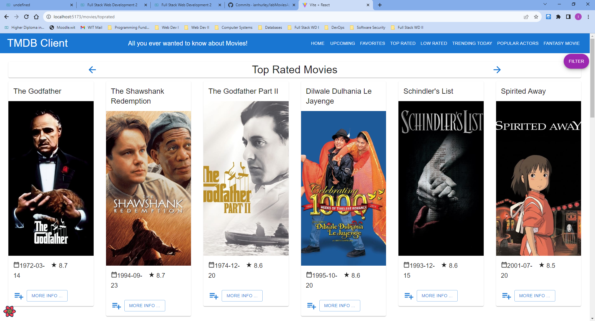
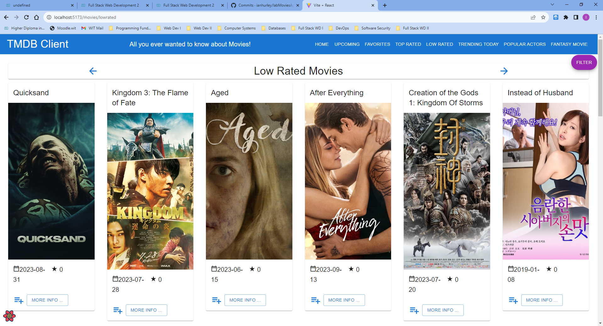
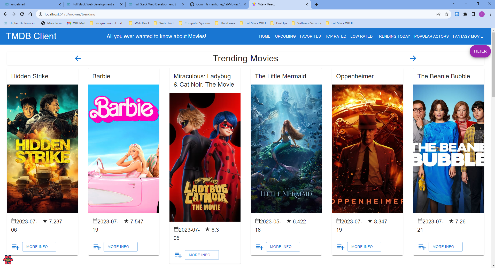
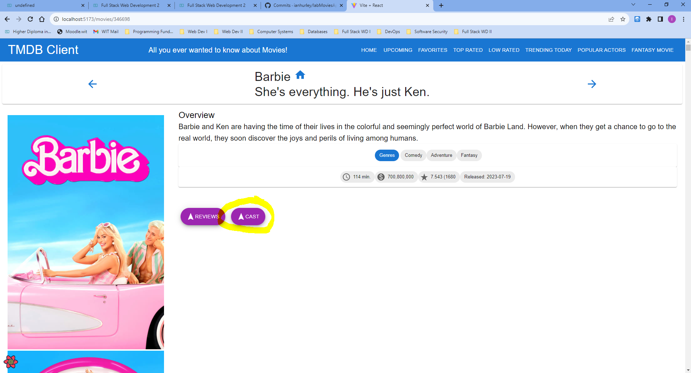
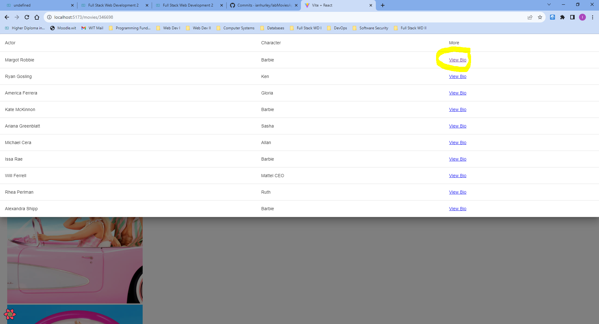

# Full Stack Development 2 - Assignment.

__Name:__ Ian Hurley

## Features.

[A bullet-point list of the features developed for the React SPA app (only new/modified ones for the Movies app),]

+ Top Rated Movies Page
+ Low Rated Movies Page 
+ Trending Movies Page
+ Popular Actors List Page
+ Cast List Drawer with Bio Link
+ Filter By Certification
+ Fantasy Movie Form

## Feature Design.

[ For each feature listed above, show a screenshot(s) of its UI layout (use appropriate magnification for accessibility). Include a caption with each image.]

e.g. 

#### Top Rated Movies Page.

> Lists movies from the Top Rated Movies endpoint of TMDB.

#### Low Rated Movies Page.

> Lists movies from the discover endpoint of TMDB with vote average rating less than 5

#### Trending Movies Page.

> Lists movies from the Trending Movies endpoint of TMDB.

#### Popular Actors List Page.

> Lists Popular Actors from the popular endpoint of TMDB.

#### Popular Actors List Page with Bio Link.

> Click the 'Cast' link of a movie to list top 10 results from the Credits endpoint of TMDB. 

> Click the 'View Bio' link of the cast list from the Person endpoint of TMDB. 

![][image6]

#### Filter By Certification

> Click the 'Filter' link on Movies to filter by Certification from the Certification endpoint of TMDB. 

![][image7]

#### Fantasy Movie Form

> Fantasy Movie page form to Create Fantasy Movie by user.

![][image8]

.... other features .......