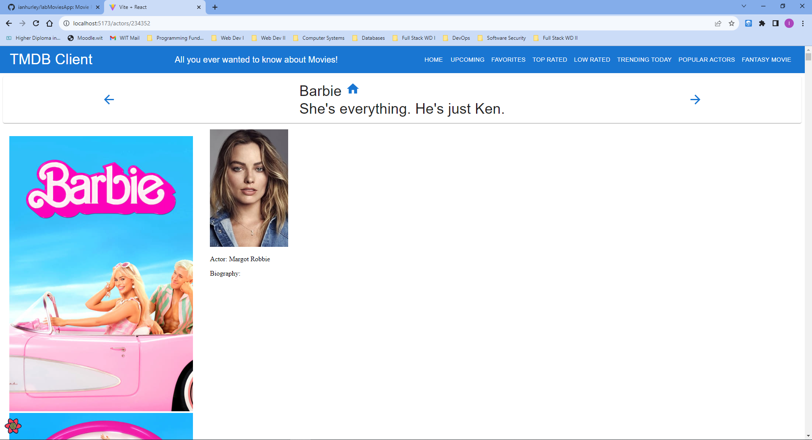
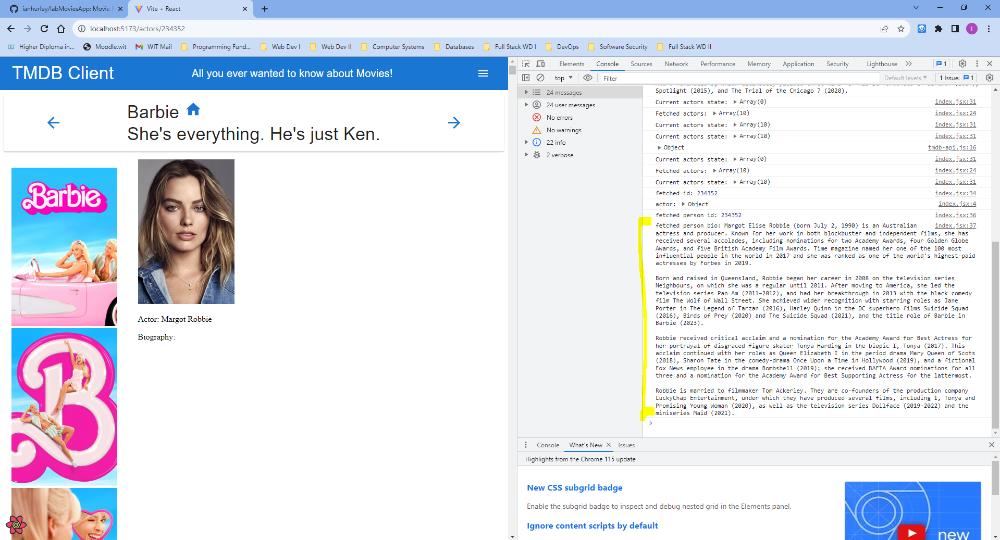
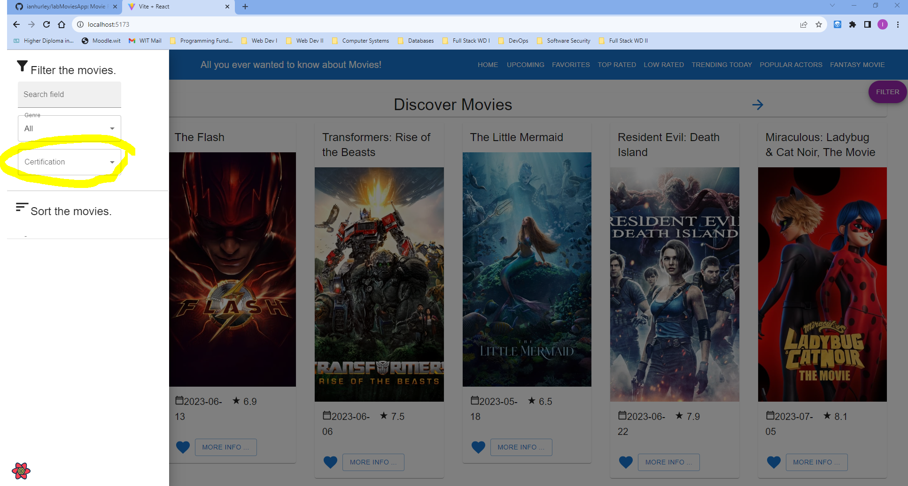
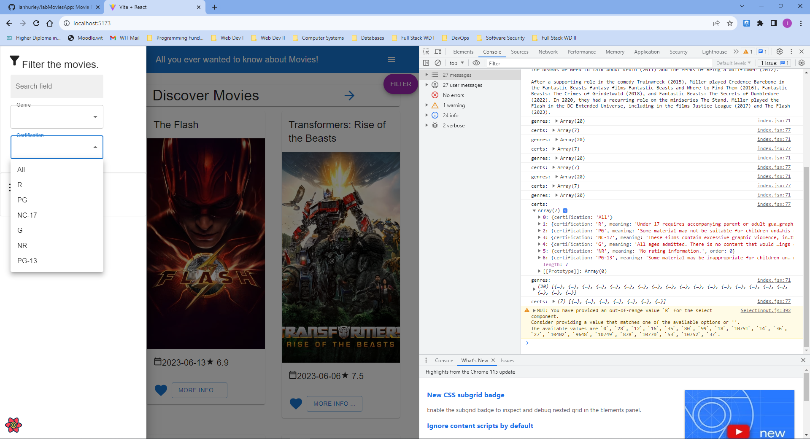
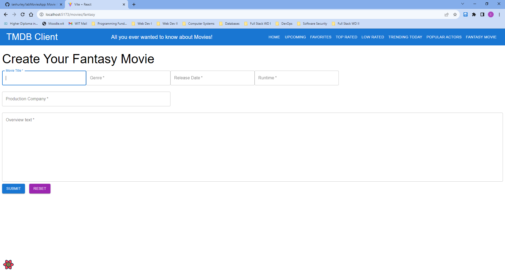
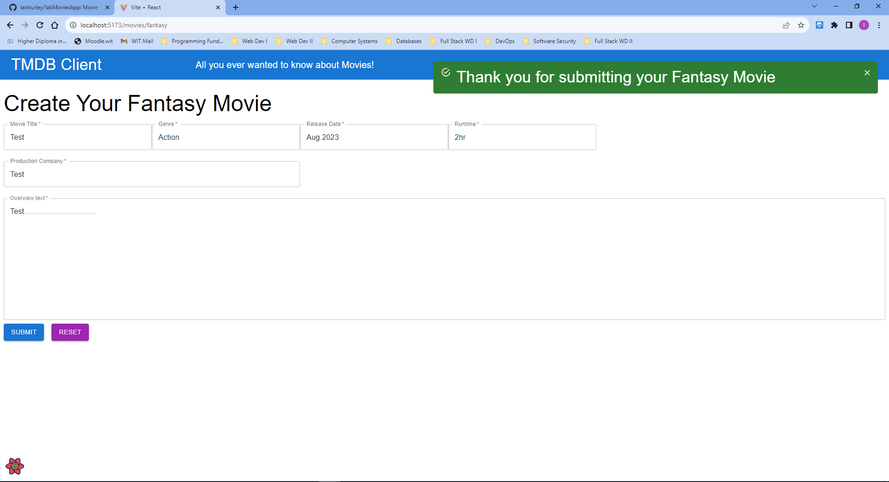

# Full Stack Development 2 - Assignment.

__Name:__ Ian Hurley

## Features.

+ Top Rated Movies Page
+ Low Rated Movies Page 
+ Trending Movies Page
+ Popular Actors List Page
+ Cast List Drawer with Bio Link
+ Filter By Certification
+ Fantasy Movie Form

## Feature Design. 

#### Top Rated Movies Page.

> Lists movies from the Top Rated Movies endpoint of TMDB.

#### Low Rated Movies Page.

> Lists movies from the discover endpoint of TMDB with vote average rating less than 5

#### Trending Movies Page.

> Lists movies from the Trending Movies endpoint of TMDB.

#### Popular Actors List Page.

> Lists Popular Actors from the popular endpoint of TMDB.

#### Cast List Drawer with Bio Link.

> Click the 'Cast' link of a movie to list top 10 results from the Credits endpoint of TMDB. 

> Cast drawer display with 'View Bio' Link. 

> Click the 'View Bio' link of the cast list from the Person endpoint of TMDB. 

> View Bio issue retrieving/displaying fetched details - unresolved.

#### Filter By Certification

> Click the 'Filter' link on Movies to filter by Certification from the Certification endpoint of TMDB. 

> Filter selection error preventing page refresh - unresolved. 

#### Fantasy Movie Form

> Fantasy Movie page form to Create Fantasy Movie by user. 

> Fantasy Movie Form Submission.

